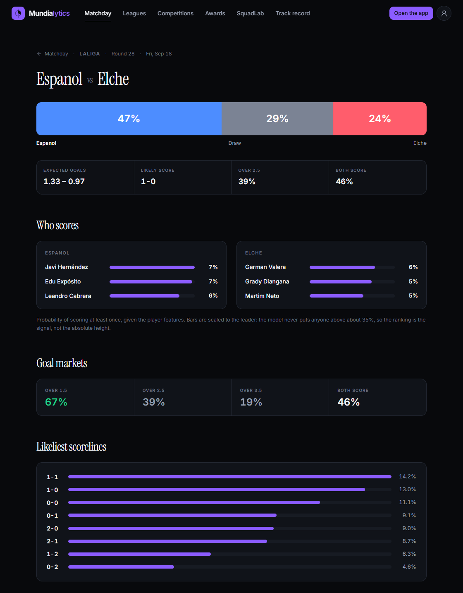
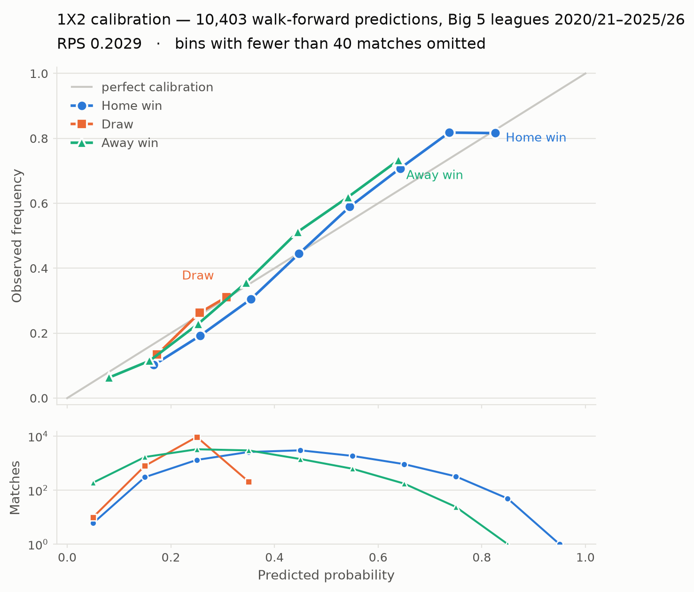

# Mundialytics

[](https://github.com/USERNAME/mundialytics/actions/workflows/tests.yml)


A football match-prediction engine: probabilistic forecasts for 1X2, over/under,
BTTS, half-time markets, team and player props — trained on 20+ seasons of the
Big 5 European leagues and benchmarked against bookmaker closing odds.

Built and operated solo over ~6 months. It runs a live forward test: every
prediction is written to a log **before kick-off** and settled against the real
result afterwards, so the track record cannot be back-fitted.

<!-- Add a screenshot of the running app as docs/img/app.png, then uncomment:

-->

## The headline result

Measured on **10,080 Big 5 matches, 2020/21–2025/26**, against Bet365's
**closing** odds (100% closing coverage, proportionally de-vigged). Odds are
never model inputs — they are only the yardstick.

| | RPS (1X2) | Log loss (1X2) | Log loss (O/U 2.5) |
|---|---|---|---|
| This engine | 0.2025 | 0.9933 | 0.6806 |
| Bet365 closing | **0.1946** | **0.9680** | **0.6710** |
| gap | +0.0080 | +0.0253 | +0.0095 |

Lower is better. The engine does **not** beat the closing line — it sits about
4% behind it, which is roughly where a good non-commercial model lands. The gap
holds across every season and every league (worst: Premier League +0.0099;
best: Bundesliga +0.0060), which is what makes it a ceiling rather than noise.
That gap was investigated directly (see [What didn't work](#what-didnt-work))
and the conclusion was to stop treating this as a betting edge and treat it as
an analytics engine. Publishing the negative result is the point.

Reproduce it:

```bash
python scripts/benchmark_vs_bet365.py
```

## Is it calibrated?

Being close to the market is one question; saying 30% and being right 30% of
the time is another. It is:



Home and away curves track the diagonal across the whole range. Draws never get
predicted above ~35% — a known property of the sport, not a defect: draws are
genuinely rarely the favourite. Regenerate with
`python scripts/plot_calibration.py`.

## How it works

```
football-data.co.uk ─┐
Understat / StatsBomb ├─→ canonical match schema ─→ features ─→ models ─→ markets
ClubElo / FBref      ─┘      (entity resolution)        │          │
                                                        │          ├─ 1X2 / O-U / BTTS
                              internal Elo ─────────────┤          ├─ half-time markets
                              walk-forward form ────────┤          ├─ team props
                              xG-rate predictor ────────┘          └─ player props
```

- **Goal model** — bivariate Poisson over attack/defence strengths estimated by
  maximum likelihood, with an internal Elo prior.
- **Form** — rolling team features computed strictly walk-forward: at every
  point in the backtest, only matches already played are visible. This was the
  single biggest accuracy gain in the project (RPS 0.2066 → 0.2027, improving in
  5 of 5 temporal folds).
- **xG** — a dedicated model predicts each side's expected-goal *rate* rather
  than using raw historical xG as a feature; the raw feature turned out to be
  largely redundant with the strength estimates.
- **Calibration** — Platt scaling per market, validated on held-out seasons.
- **Markets** — the score matrix is derived once and every market (totals,
  BTTS, half-time, correct score) is read off it, so they stay mutually
  consistent by construction.

Validation is **temporal out-of-sample throughout**: train on seasons up to
year *N*, test on *N+1*. Never k-fold — shuffled folds leak the future into the
training set and inflate football models badly.

## What didn't work

Recorded because negative results are the expensive part of the project:

- **Beating the closing line.** Four experiments across price levels, leagues,
  seasons and divisions. Not a calibration problem, not home advantage, not
  missing lineups (oracle-capped at ~3% gain), not lower divisions, not opening
  prices. Bet365 was ahead everywhere. Conclusion: stop.
- **xG as a direct feature.** Redundant with the maximum-likelihood strength
  estimates. Only the derived xG-*rate* predictor added signal.
- **Per-team first-half share.** Measured correlation r = −0.118 — noise. The
  half-time markets use a global scaling instead.

## Running it

```bash
python -m venv .venv
source .venv/bin/activate        # Windows: .venv\Scripts\activate
pip install -r requirements.txt
pip install -e .
pytest tests/                    # 176 tests
streamlit run app/streamlit_app.py
```

The Streamlit app has three sections: match predictions, competition
forecasting (league tables and European tournaments by Monte Carlo), and
SquadLab, a sandbox for simulating hypothetical or historical squads.

## Layout

```
src/mundialytics/
├── statistical_core/   probability engine, simulator, dynamic lines
├── models/             goals, events, minutes
├── features/           rolling team features, player baselines
├── ratings/            internal Elo
├── evaluation/         RPS, Brier, log loss, walk-forward backtesting
├── betting/            odds, value, staking, market mapping
├── props/              player and team prop markets
├── data/               schema, entity resolution, provider adapters, QC
└── simulation/         tournament Monte Carlo

scripts/                ~200 CLI entry points — see scripts/README.md
tests/                  176 passing tests
docs/                   design docs and full version history
```

## Scope and honesty

This is a research and analytics project run in **paper mode**. No money has
been staked on it and it is not intended as a betting product — the benchmark
above is precisely the reason. Data comes from free public sources
(football-data.co.uk, StatsBomb Open Data, ClubElo, FBref, Understat).

Full version-by-version history: [`docs/README_FULL.md`](docs/README_FULL.md)
and [`CHANGELOG.md`](CHANGELOG.md). Design decisions:
[`docs/MODEL_DESIGN.md`](docs/MODEL_DESIGN.md) and
[`docs/DECISIONS.md`](docs/DECISIONS.md).

## License

MIT
